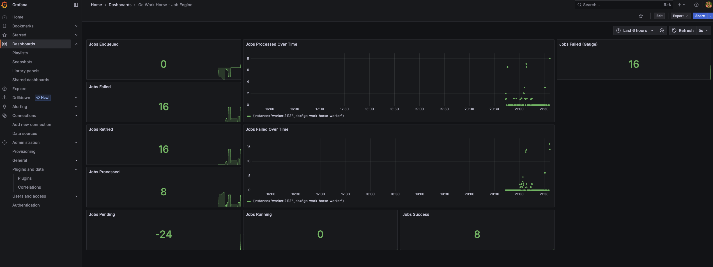
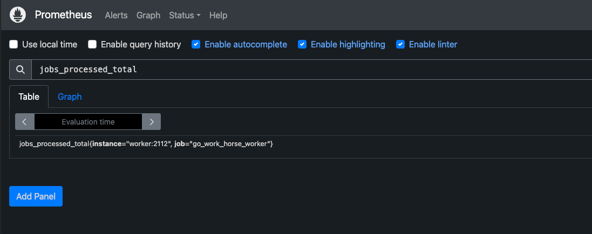
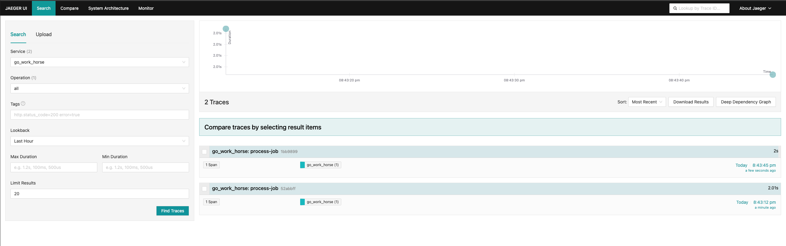
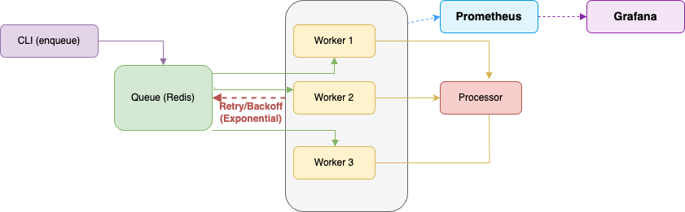

# 🐎 GoWorkhorse - Job Engine Assíncrono em Go

<div align="center">


<div data-badges>
  
  
  
</div>

<div data-badges>
  
  
  
  
  
  
</div>
</div>

O **GoWorkhorse** é um engine assíncrono de jobs, altamente performático, escalável e confiável, desenvolvido em Go. Ideal para workloads intensivos, processamento em background, automação e pipelines distribuídos.

✔ **Fila persistente plugável** (Redis, PostgreSQL - inicial Redis)

✔ **Pool de workers concorrentes** com limite configurável

✔ **Política de retries** com backoff exponencial e registro de falhas

✔ **Observabilidade completa**: Prometheus, Grafana, OpenTelemetry, Jaeger

✔ **Logs estruturados** e métricas detalhadas

✔ **Testes automatizados e ambiente Docker Compose para simulação local**

Desenvolvido com Go, Redis, Prometheus, Grafana, OpenTelemetry e Jaeger, garantindo robustez, resiliência e visibilidade total do processamento assíncrono.

---

## 🖥️ Como rodar este projeto 🖥️

### Requisitos:

- [Go 1.21+](https://golang.org/doc/install)
- [Docker & Docker Compose](https://docs.docker.com/get-docker/)
- Redis 6.0+ (ou via Docker)

### Execução:

1. Clone este repositório:

   ```sh
   git clone https://github.com/lorenaziviani/go_work_horse.git
   ```

2. Acesse o diretório do projeto:

   ```sh
   cd go_work_horse
   ```

3. Instale as dependências:

   ```sh
   go mod download
   ```

4. Configure as variáveis de ambiente (opcional):

   ```sh
   cp configs/config.example.yaml configs/config.yaml
   # Edite configs/config.yaml conforme necessário
   ```

5. Inicie todos os serviços com Docker Compose (recomendado):

   ```sh
   docker-compose up -d
   ```

6. Ou execute localmente:

   ```sh
   # Inicie o Redis
   docker run -d --name redis -p 6379:6379 redis:alpine

   # Enfileire jobs
   go run cmd/enqueue/main.go '{"foo":"bar"}'

   # Inicie os workers
   go run cmd/worker/main.go
   ```

7. Acesse os serviços:
   - **Grafana**: [http://localhost:3000](http://localhost:3000) (admin/admin)
   - **Prometheus**: [http://localhost:9090](http://localhost:9090)
   - **Jaeger**: [http://localhost:16686](http://localhost:16686)

---

## 🗒️ Features do projeto 🗒️

⚡ **Engine Assíncrono & Concorrente**

- **Fila persistente** (Redis, plugável para outros brokers)
- **Pool de workers concorrentes** (limite configurável)
- **Política de retries** com backoff exponencial
- **Atualização de status dos jobs** (pending, running, success, failed)
- **Logs estruturados** (JSON)
- **Configuração via arquivo/env** (Viper)

🔍 **Observabilidade Completa**

- **Métricas Prometheus**
  - Jobs enfileirados, processados, falhos, retries
  - Latência e duração dos jobs
  - Exposição em `/metrics`
- **Tracing distribuído (Jaeger/OpenTelemetry)**
  - Spans detalhados do processamento de jobs
  - Correlação de falhas e performance
- **Dashboards Grafana**
  - Visualização de métricas em tempo real
  - Painel customizado incluso

🧪 **Testes & Automação**

- **Testes unitários** (struct Job, fila Redis)
- **Testes de integração end-to-end**
- **Makefile** com targets para build, testes, lint, cobertura, enqueue, CI
- **Ambiente Docker Compose** para simulação local

---

## 🔧 Comandos de Teste 🔧

```bash
# Rodar todos os testes
make test

# Testes unitários
make test-unit

# Teste de integração end-to-end
make test-integration

# Build, lint, cobertura, enqueue, etc
make build
make lint
make coverage
make enqueue
make ci

# Ver todos os comandos disponíveis
make help
```

---

## 📈 Monitoramento e Dashboards 📈

### Grafana Dashboard

Acesse [http://localhost:3000](http://localhost:3000) com **admin/admin123** para ver:

- Jobs enfileirados, processados, falhos e retries
- Latência e duração dos jobs
- Métricas de fila em tempo real



### Prometheus Metrics

Acesse [http://localhost:9090](http://localhost:9090) para monitorar:

- Métricas em tempo real do engine
- Targets e endpoints sendo coletados
- Queries customizadas para análise



### Jaeger Tracing

Acesse [http://localhost:16686](http://localhost:16686) para visualizar:

- Traces distribuídos do processamento de jobs
- Latência e performance detalhada
- Dependency graphs automáticos



---

## 🏗️ Arquitetura do Sistema 🏗️



```
CLI Enqueue → Redis Queue → Pool de Workers (Go) → Observabilidade (Prometheus, Grafana, Jaeger)
```

**Fluxo detalhado:**

1. **CLI Enqueue**: Enfileira jobs na fila persistente (Redis)
2. **Workers**: Consomem jobs concorrentes, processam, aplicam retries/backoff
3. **Observabilidade**: Métricas e traces expostos para Prometheus, Grafana e Jaeger

---

## 💎 Links úteis 💎

- [Go Documentation](https://golang.org/doc/)
- [Redis Documentation](https://redis.io/documentation)
- [Prometheus](https://prometheus.io/docs/)
- [Grafana](https://grafana.com/docs/)
- [OpenTelemetry Go](https://opentelemetry.io/docs/instrumentation/go/)
- [Jaeger Tracing](https://www.jaegertracing.io/docs/)
